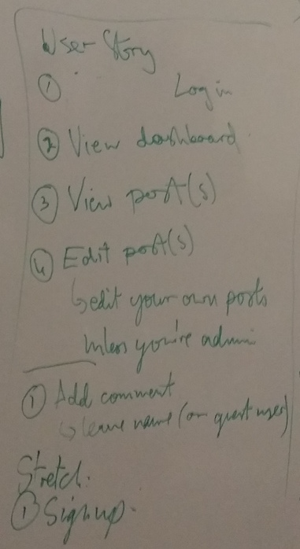
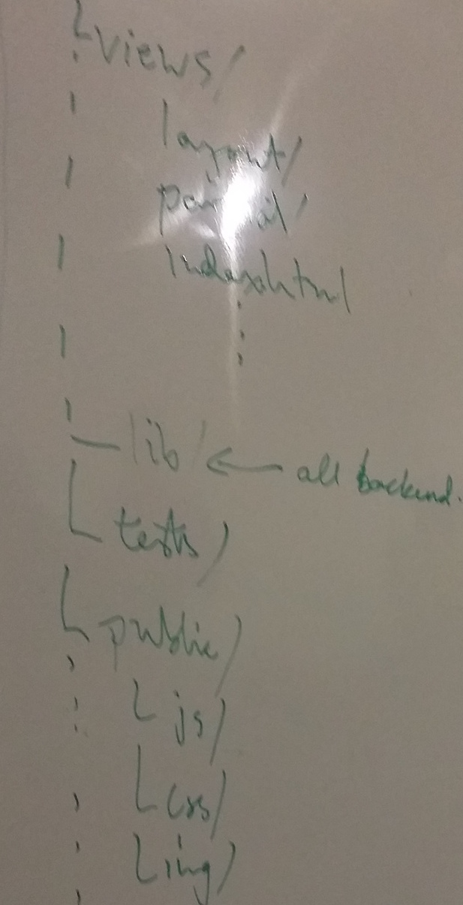
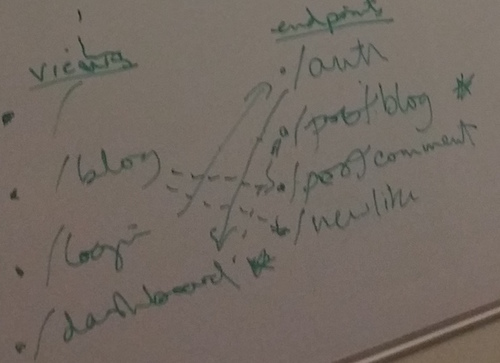
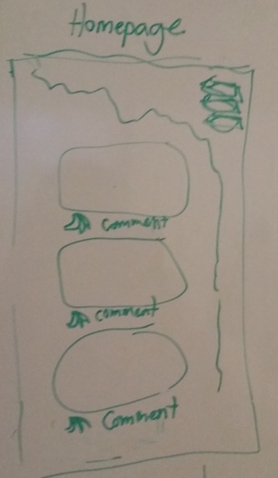
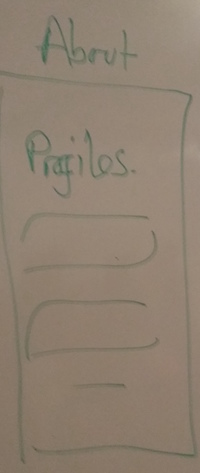
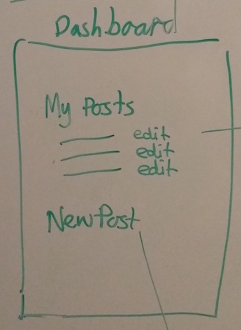
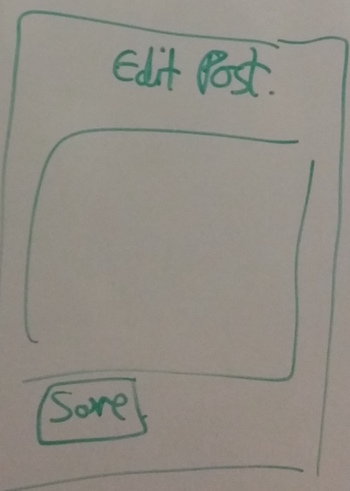
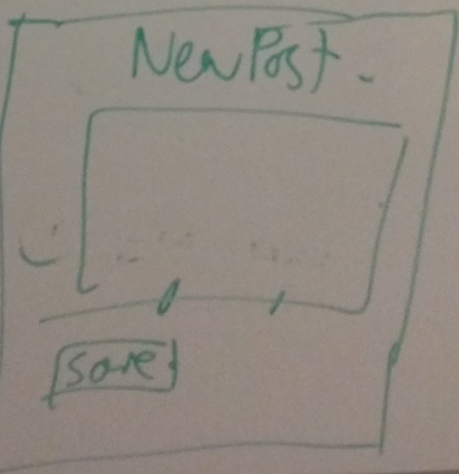

[](https://github.com/tasminions/minionchat)
[](https://codeclimate.com/github/tasminions/blog)
[](https://codeclimate.com/github/tasminions/blog)
[](https://codeclimate.com/github/tasminions/blog/coverage)
[](http://codecrystal.herokuapp.com/crystalise/tasminions/blog/master)
# Blog

Check it out on heroku! http://tasminionsblog.herokuapp.com/

## What & Why
This is a blog about monkeys made with hapijs, with the purpose of practicing the following topics (specified here):
server routes
authentication
SASS framework
saving created/edited posts on a database.

## Wireframes

















## Data Structure
```
{
  "posts": {
    "29382": {
      "id": "9352",
      "title": "ifn",
      "author": "ownwv",
      "date": "fwepihrv",
      "body": "Liwehofrg",
      "comments": [{
        "author": "foence",
        "date": "eqfbwr",
        "body": "ewobrw"
      }, {
        "author": "foence",
        "date": "eqfbwr",
        "body": "ewobrw"
      }],
      "likes": 234
  },
  "users": {
    "john": {
      "secret": "piqhefwc",
      "isAdmin": true,
      "email": "rwohgj"
    }
  }
}
```
## Instructions

In order to get a chat room hosted on your machine, follow these instructions:

+ Setup a redis instance
+ Clone the repo
+ Run npm install
+ Create a config.env file with the following lines:  
  + REDIS_URL=reds://url/to/redis/server
  + REDIS_DB=[int] # whichever database number you want to run
  + PORT=[int] # whichever port you want to run
  + Run npm start and navigate to http://localhost:[PORT]
